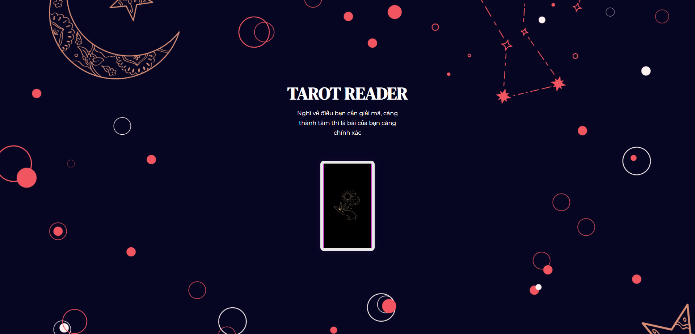
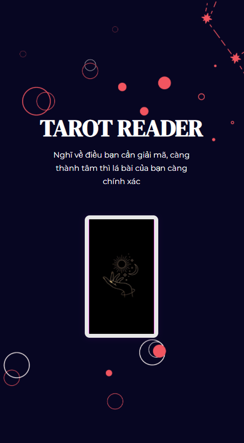

# Tarot reader 🔮

  
  

This is a simple tarot reading application which randomize a card up to your devotion. Click on the card and It will answer your questions. You can try again to get another answer. Save your card and have a good time using this.

# Copyrights
Thanks to <a href="https://github.com/gabrielaalvescosta/ChooseACardTarot" target="_blank">this author</a> for the beautiful tarot repository.
